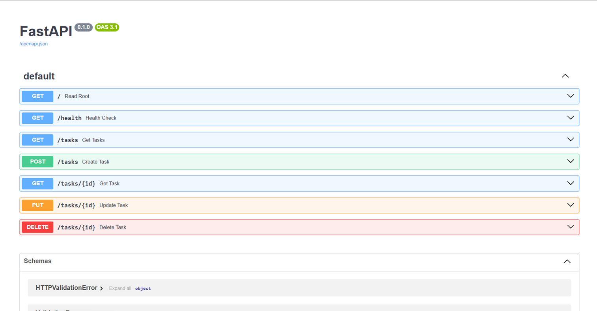

# FlyRank Task API - Week 3 (Database Integration)

A simple CRUD API for managing a to-do list, built with Python, FastAPI, and SQLModel. Originally using an in-memory array (Week 2), the storage layer has now been upgraded to a real SQLite database so that data survives server restarts.

## How to Start the Project

To start the server on localhost, run this command in your terminal:
```bash
uvicorn main:app --reload
```
**Note:** On startup, the application will automatically create the database file and seed it with 3 example tasks if the table is completely empty.

## Database Architecture

* **Why SQLite was chosen:** SQLite was chosen because it is lightweight, requires zero setup or separate server installation, and runs entirely from a single file. It is the perfect tool to add permanent data persistence to our application so tasks survive restarts.
* **Where the database file is stored:** The database is stored locally in a file named `tasks.db` located in the root of the project directory. *(Note: this file is usually added to `.gitignore` so fresh clones generate their own blank database).*

## Example SQL Query

Here is an example query I executed manually using DB Browser for SQLite to view only the completed tasks:
```sql
SELECT * FROM tasks WHERE done = 1;
```

## Proof of Implementation Detail (Stretch Goal)

Even though the entire storage engine was swapped from an in-memory Python array to a SQLite database, the API endpoints did not change. The URLs, request bodies, validation rules (400 errors), and response codes (200, 201, 204, 404) remained completely identical. Identical tests passing proves that the database is purely an "implementation detail"—the API is the promise to the client, and the database is simply where the API keeps that promise.

## Endpoints

| Method | Path | Description |
|---|---|---|
| GET | `/` | API details |
| GET | `/health` | Health check |
| GET | `/tasks` | List all tasks |
| GET | `/tasks/{id}` | Get a specific task by ID (Returns 404 if unknown) |
| POST | `/tasks` | Create a new task (Defaults done to false) |
| PUT | `/tasks/{id}` | Update an existing task's title or status |
| DELETE | `/tasks/{id}` | Delete a task (Returns 204 No Content) |

## Screenshots

**1. Swagger UI (Testing Endpoints)**


**2. DB Browser for SQLite (Viewing the Data)**
`)*